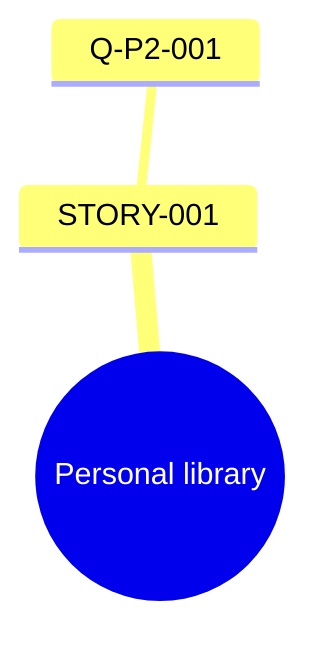

# Personal IELTS Speaking Library Schemas

Use these schemas for the copyable and round-trippable `ielts-speaking-library.md`. Keep stable IDs. Use `未提供` only for an explicitly known gap; never fill a field by inference.

## Master document

````markdown
# IELTS Speaking Personal Library

> Updated: YYYY-MM-DD
> Evidence policy: Only learner-confirmed facts are stored. Target bands are practice references, not score promises.

## Library status
- Source question banks: ...
- Confirmed cards: Profile N / Story N / Viewpoint N
- Language samples: ...

## Question catalog
| Question ID | Part | Exact original question | Topic | Response requirements | Needed material | Duplicate group | Cluster |
|---|---:|---|---|---|---|---|---|

## Profile cards
### PROFILE-001 — [topic]
- 主题：
- 个人偏好：
- 原因：
- 真实例子：
- 过去与现在的变化：
- 事实来源：

## Story cards
### STORY-001 — [story title]
- 故事标题：
- 时间：
- 地点：
- 人物关系：
- 事件背景：
- 目标：
- 困难：
- 行动：
- 转折：
- 结果：
- 情绪变化：
- 具体细节：
- 个人反思：
- 可迁移角度：
- 事实来源：

## Viewpoint cards
### VIEW-001 — [topic]
- 主题：
- 个人立场：
- 核心原因：
- 现实例子：
- 对比观点：
- 让步条件：
- 结论：
- 事实来源：

## Question-to-card mapping
| Exact original question | Card ID | Match | Recommended angle | Required adjustment | Forced-link risk |
|---|---|---|---|---|---|

## Coverage
- 自然覆盖：N / total
- 调整后可用：N / total
- 不建议使用：N / total
- Missing material: ...

## Reuse mind map


## Language-style record
- Evidence base: [confirmed sample IDs or dates]
- Comfortable sentence patterns:
- Natural recurring phrases:
- Repeated words to diversify:
- Frequent grammar or collocation risks:
- Preferred answer rhythm or organization:
- Next practice priority:
````

If Mermaid would not render, replace it with an indented Markdown tree while preserving every relationship.

## Question catalog rules

- Assign `Q-P1-###`, `Q-P2-###`, or `Q-P3-###` in source order.
- Preserve the exact original wording, including distinct cue-card bullets.
- Use one duplicate-group ID only for exact duplicates or strict task-equivalent paraphrases. Keep similar-but-distinct prompts in separate duplicate groups, even when they share a cluster or card.
- Treat two prompts as task-equivalent only when Part, question function, central target, actor or relationship, time or polarity constraints, and required fact set are interchangeable. If answering one can still miss a required fact in the other, they are not duplicates.
- Write response requirements as concrete obligations, such as `describe a person + relationship + influence`.
- Choose needed material from `profile fact`, `story`, `viewpoint`, or a combination.

## Card rules

- Store one coherent fact set per card. Split stories when their time, people, or event arc is materially different.
- Keep one central claim or decision target per viewpoint card. Split `why people give up`, `should schools teach`, and `should parents teach` into separate viewpoint cards even when one interview supplies evidence for all three; cross-reference shared examples instead of collapsing the claims.
- Put only a concrete confirmed case, event, observation, or personal experience in `现实例子`. A category list, recommended measure, mechanism, or hypothetical scenario is not a real example. Use `未提供` when no concrete example was supplied.
- Render every listed field in the documented order whenever a card is displayed or exported. Use `未提供` after the interview budget is exhausted; never shorten a card by dropping fields.
- Keep `事实来源` auditable, for example `用户确认：2026-07-18 采访模块2` or `用户确认：练习样本 P2-2026-07-18`.
- Do not store interview candidates, model suggestions, or synthetic example details as facts.
- Mark a field `未提供` only after the interview budget is exhausted or the learner chooses to skip it.
- Update a card in place when the learner clarifies it; record a separate card when both facts are true in different periods or contexts.

## Mapping schema

Allowed `Match` values are exact:

- `自然覆盖`: the confirmed card directly satisfies the central task with only normal selection of details.
- `调整后可用`: the card can satisfy the task after changing emphasis, framing, or a minor non-factual bridge.
- `不建议使用`: the central requirement is absent, contradictory, or would require invented facts or an unnatural angle.

`Required adjustment` must name the framing change without changing facts. `Forced-link risk` must explain the specific mismatch; use `低` only when there is no material credibility or relevance problem.

For Part 3, `自然覆盖` requires a confirmed position, reason, and concrete example. Use `调整后可用` only when another confirmed profile/story/viewpoint card can supply the missing example without inventing facts. Otherwise use `不建议使用` and request one focused example.

## Coverage and persistence

- Count every original catalog row, even when duplicates share a group.
- Report the three match categories separately; do not hide `不建议使用` inside a combined coverage percentage.
- Keep the complete question catalog and all confirmed cards in every exported snapshot so the learner can upload it in a later session.
- Keep the language-style record evidence-based and concise. Update it from real English samples, not demographic assumptions.
- After a confirmation, answer, or review, export the complete master document—not only the changed card. If a file cannot be written, place the entire document in one copyable Markdown fence before continuing the interview.
